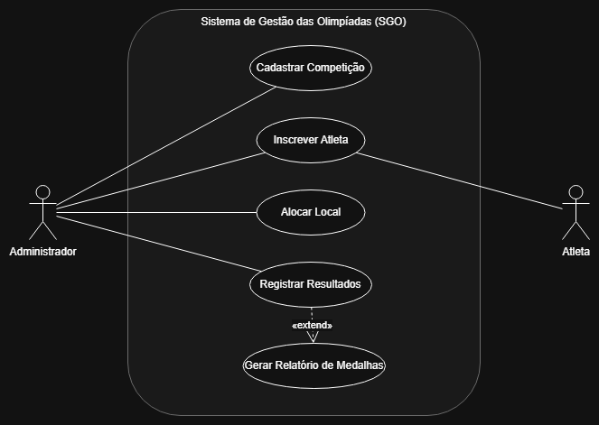
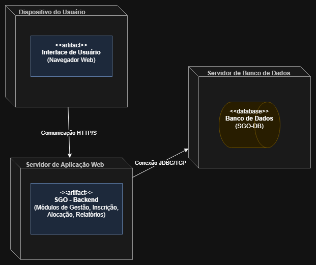

# Sistema de Gestão das Olimpíadas (SGO)

## 1. Descrição do Sistema

Com a chegada das Olimpíadas, um novo sistema de gestão é necessário para coordenar os diferentes aspectos do evento. Este sistema deve permitir o gerenciamento de competições, inscrições de atletas, alocação de locais para as provas, e controle de resultados.

## 2. Histórias de Usuário

Abaixo estão as histórias de usuário que descrevem as funcionalidades do sistema, baseadas nas regras de negócio fornecidas:

* **US01 (Cadastrar Competição):** Eu, como Administrador, quero cadastrar uma nova competição (com modalidade, data, horário e local), para que o evento possa ser organizado e os atletas possam se inscrever.
* **US02 (Inscrever Atleta):** Eu, como Administrador, quero inscrever um atleta (de um país específico) em uma ou mais competições, para que ele possa participar.
* **US03 (Validação de Inscrição):** Eu, como Administrador, quero que o sistema valide que um atleta só possa representar um país por modalidade, para garantir a conformidade com as regras olímpicas.
* **US04 (Alocar Local):** Eu, como Administrador, quero alocar um local para uma competição em um horário específico, para que as provas possam ocorrer.
* **US05 (Validação de Alocação):** Eu, como Administrador, quero que o sistema me impeça de alocar um local que já esteja em uso no mesmo horário, para evitar conflitos de agendamento.
* **US06 (Registrar Resultados):** Eu, como Administrador, quero registrar os resultados de uma competição finalizada, para determinar os atletas em primeiro (ouro), segundo (prata) e terceiro (bronze) lugares.
* **US07 (Gerar Relatório de Medalhas):** Eu, como Administrador (ou Público), quero gerar um relatório de medalhas, mostrando o desempenho de cada país com base nas medalhas conquistadas, para acompanhar o ranking geral.

## 3. Diagramas UML

### Diagrama de Caso de Uso

### Diagrama de Classes e de Pacotes

### Diagrama de Componentes

### Diagrama de Implantação

